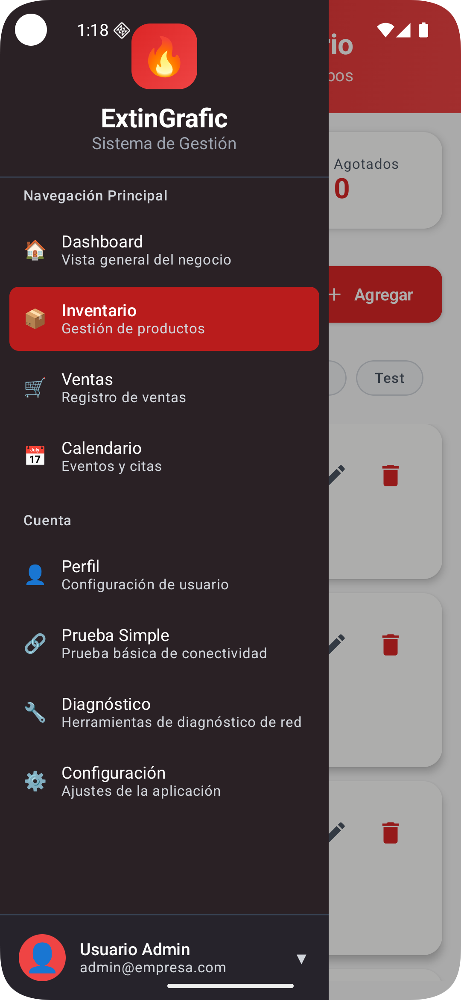
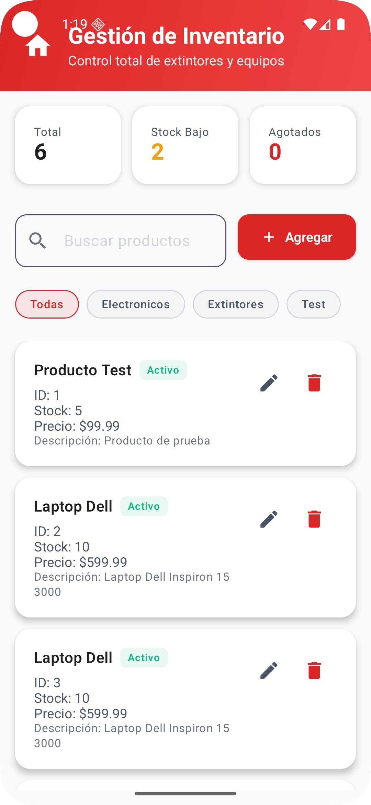

# Sistema de Inventario - Tesis V3

Un sistema completo de gestión de inventario desarrollado con tecnologías modernas, incluyendo aplicaciones móviles multiplataforma y web.

## 📸 Capturas de Pantalla

### Interfaz de Usuario Móvil

| Menú Sidebar | Gestión de Inventario |
|--------------|----------------------|
|  |  |

*Capturas de pantalla mostrando la interfaz de usuario de la aplicación móvil con el menú de navegación lateral y la pantalla de gestión de inventario.*

## 🏗️ Arquitectura del Proyecto

Este proyecto incluye múltiples aplicaciones:

- **📱 Aplicación Móvil** (Kotlin Multiplatform + Compose)
- **🖥️ Aplicación Web** (Next.js + TypeScript)
- **🚀 Servidor Backend** (Ktor + PostgreSQL)

## 📁 Estructura del Proyecto

```
TesisV3/
├── composeApp/          # Aplicación móvil (Android/iOS/Desktop)
├── business-app/        # Aplicación web de gestión
├── server/             # Servidor backend API
├── shared/             # Código compartido
├── iosApp/             # Configuración específica de iOS
└── imagesScreenshotsGithub/ # Capturas de pantalla para documentación
```

## ✅ Estado Actual del Desarrollo

### Completado
- ✅ Configuración inicial del proyecto multiplataforma
- ✅ Estructura básica del backend con Ktor
- ✅ Interfaz de usuario móvil con Compose Multiplatform
- ✅ Sistema de navegación con menú lateral
- ✅ Pantalla de gestión de inventario
- ✅ Diálogos para agregar/editar productos
- ✅ Componentes UI personalizados (ExtintorCard, ExtintorButton, etc.)
- ✅ Integración con API REST para productos

### En Desarrollo
- 🔄 Sincronización de datos entre plataformas
- 🔄 Validaciones avanzadas de formularios
- ⏳ Funcionalidades de reportes y analytics

### Pendiente
- ⏳ Autenticación y autorización
- ⏳ Notificaciones push
- ⏳ Modo offline
- ⏳ Tests unitarios y de integración

## 🛠️ Tecnologías Utilizadas

### Backend
- **Ktor** - Framework web para Kotlin
- **PostgreSQL** - Base de datos
- **Exposed** - ORM para Kotlin
- **HikariCP** - Pool de conexiones

### Aplicación Móvil
- **Kotlin Multiplatform** - Código compartido multiplataforma
- **Compose Multiplatform** - UI moderna y declarativa
- **Ktor Client** - Cliente HTTP para comunicación con API
- **Material Design 3** - Sistema de diseño

### Aplicación Web
- **Next.js 15** - Framework React moderno
- **TypeScript** - Tipado estático
- **Tailwind CSS** - Estilos utilitarios
- **Shadcn/ui** - Componentes de UI

## 🚀 Configuración e Instalación

### Prerrequisitos
- JDK 11 o superior
- Android Studio (para desarrollo móvil)
- Node.js 18+ (para aplicación web)
- PostgreSQL (para la base de datos)

### 1. Configuración del Backend

```bash
# Navegar al directorio del proyecto
cd TesisV3

# Ejecutar el servidor
./gradlew :server:run
```

El servidor estará disponible en `http://localhost:8080`

### 2. Configuración de la Aplicación Móvil

```bash
# Compilar la aplicación móvil
./gradlew :composeApp:assembleDebug

# Para ejecutar en desktop
./gradlew :composeApp:run
```

### 3. Configuración de la Aplicación Web

```bash
# Navegar al directorio de la aplicación web
cd business-app

# Instalar dependencias
pnpm install

# Ejecutar en modo desarrollo
pnpm dev
```

## 🔧 Configuración de Base de Datos

La aplicación está configurada para conectarse a la base de datos PostgreSQL de la Universidad del Bío-Bío:

- **Host**: `pgsqltrans.face.ubiobio.cl:5432`
- **Base de datos**: `dpozas_bd`

### Scripts SQL Disponibles
- `verificar_db.sql` - Verificar conexión y estructura
- `limpiar_db.sql` - Limpiar datos de prueba

## 📱 Características de la Aplicación Móvil

- ✅ **Conectividad verificada** - Sistema de diagnóstico de conexión
- ✅ **Gestión de inventario** - CRUD completo de productos
- ✅ **Interfaz moderna** - Compose Multiplatform
- ✅ **Multiplataforma** - Android, iOS y Desktop

## 🌐 Características de la Aplicación Web

- 📊 **Dashboard** - Visualización de métricas
- 📦 **Gestión de inventario** - Interface web completa
- 📅 **Calendario** - Planificación y seguimiento
- 💰 **Módulo de ventas** - Gestión de transacciones

## 🔗 API Endpoints

### Inventario
- `GET /api/inventario` - Obtener todos los productos
- `POST /api/inventario` - Crear nuevo producto
- `PUT /api/inventario/{id}` - Actualizar producto
- `DELETE /api/inventario/{id}` - Eliminar producto
- `PATCH /api/inventario/{id}/stock` - Actualizar stock

### Salud del Sistema
- `GET /health` - Verificar estado del servidor

## 🐛 Solución de Problemas

### Problema de Conectividad Móvil
Si la aplicación móvil no puede conectarse al servidor:

1. Verificar que el servidor esté ejecutándose en el puerto 8080
2. Para emulador Android: usar `http://10.0.2.2:8080`
3. Para dispositivo físico: usar la IP de tu computadora
4. Verificar permisos de internet en AndroidManifest.xml

### Logs de Diagnóstico
La aplicación incluye logs detallados para diagnosticar problemas de conectividad:
```
🔍 Verificando conexión a: http://10.0.2.2:8080/health
✅ Conexión exitosa: 200 OK
🔄 Obteniendo productos desde: http://10.0.2.2:8080/api/inventario
✅ Productos obtenidos: 5
```

## 📚 Documentación Adicional

- `guia_postman.md` - Guía para probar la API con Postman

## 👨‍💻 Desarrollo

Este proyecto es parte de una tesis universitaria enfocada en el desarrollo de sistemas de gestión empresarial con tecnologías modernas multiplataforma.

## 📄 Licencia

Proyecto académico - Universidad del Bío-Bío
